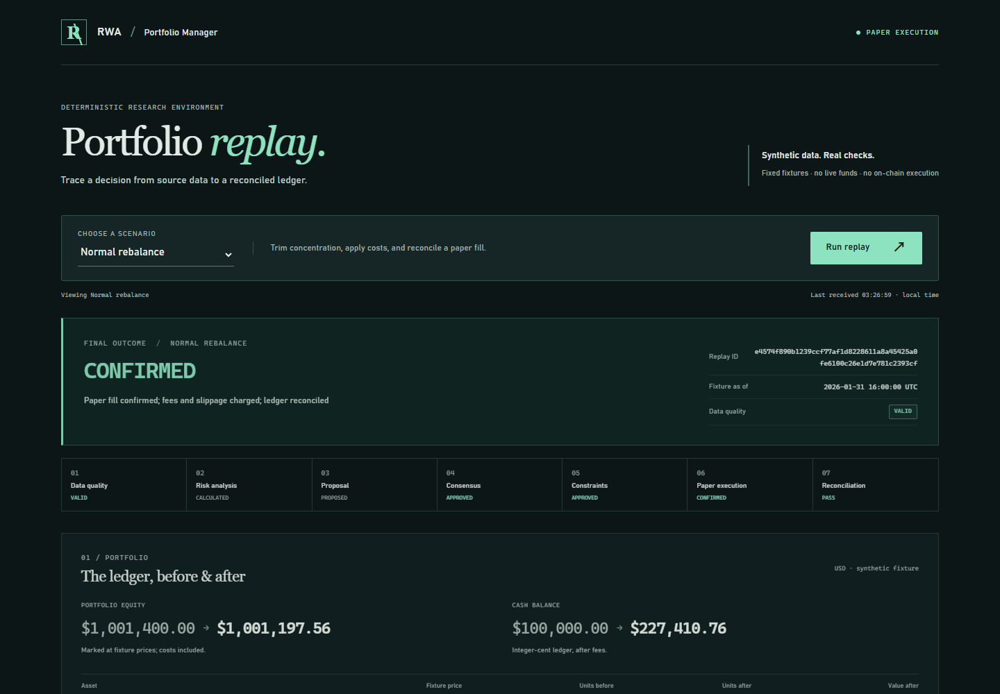
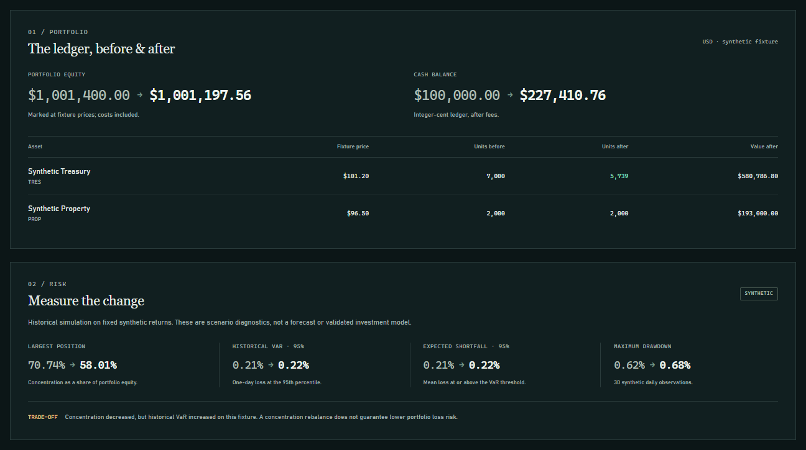
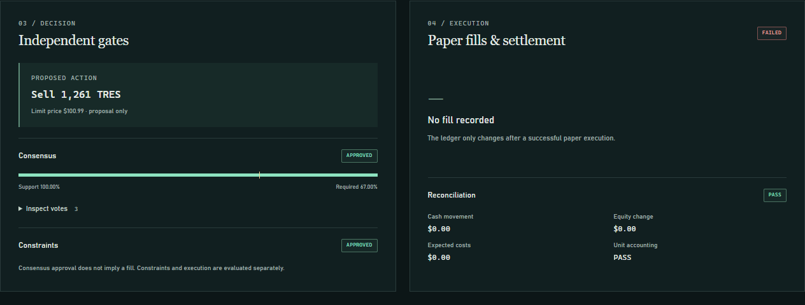
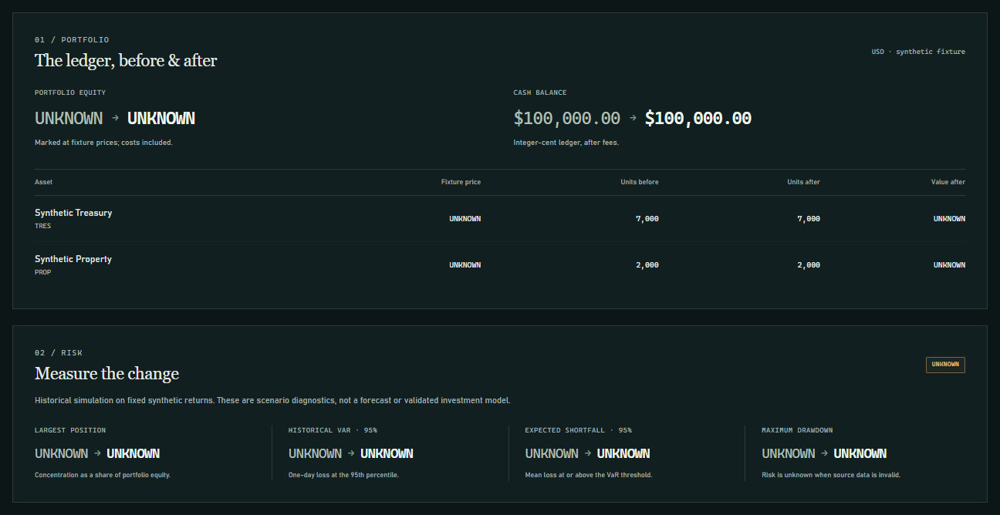
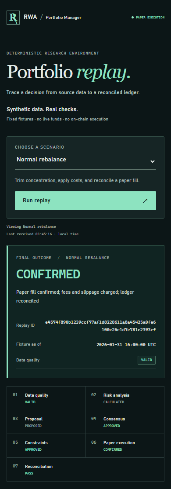

# RWA Portfolio Manager

A reproducible **paper-execution and audit-replay prototype** for portfolio risk controls. Fixed data becomes a risk assessment, a voted proposal, an independently constrained trade, a costed fill, and a reconciled ledger. Failure cases are runnable examples, not hidden behind a success badge.

**PAPER ONLY · SYNTHETIC DATA · NO REAL FUNDS.** This is a tested engineering demonstrator, not a validated investment strategy, authenticated trading service, production custody system, or verified Flare integration. Development originated at a hackathon with AI assistance.



## Reproduce a complete run

Use Node **24.13.0** (`.nvmrc`) and npm **11.x**. The lockfile fixes the dependency graph. Installation needs the npm registry; the pipeline, tests and local contract compiler need no API keys, external data, RPC, model service or LLM afterward.

```bash
npm ci
npm run verify
npm run replay -- --input artifacts/paper/normal/audit.jsonl --report artifacts/paper/normal/run.json
```

`verify` runs type checks, application and contract tests, builds, and all seven scenarios with semantic replay. Each scenario writes `run.json`, `audit.jsonl`, and `audit-head.txt` under `artifacts/paper/<scenario>/`. These are generated evidence, not tracked source files. The same code, fixture, policy and scenario produce byte-identical JSON on the supported runtime. Re-running a scenario replaces its generated artifacts; use `--out <directory>` to keep a separate run.

```bash
npm run demo
npm run demo -- --scenario execution-failure
npm run demo:all
npm run dev:all
```

Open the dashboard at **http://localhost:5173**. The API binds to **127.0.0.1:3001**. No `.env` is necessary. Setting `EXECUTION_MODE` to anything other than `PAPER` aborts application startup. Scenario runs start from the same initial ledger; they are not successive trades on a persistent account.

## Dashboard views

Captured from the running local app with synthetic fixtures. Expand a view below; reproduce it with `npm run dev:all` and the scenario selector.

<details>
<summary>Normal replay — ledger and risk</summary>

One costed paper fill changes cash and holdings. Concentration falls while this fixture's historical VaR rises; both are visible rather than summarized as a universal risk improvement.



</details>

<details>
<summary>Execution failure — approval is not a fill</summary>

In `execution-failure`, consensus and constraints approve, but the broker refuses the fill. Cash and units remain unchanged. Reconciliation PASS confirms that accounting, not successful execution.



</details>

<details>
<summary>Missing data — UNKNOWN, not zero risk</summary>

In `missing-price`, execution is blocked. NAV and risk remain UNKNOWN; known cash and unit balances are preserved.



</details>

<details>
<summary>Mobile layout — the same replay on a narrow screen</summary>

Scenario controls, final outcome and pipeline stages adapt to a 390-pixel-wide viewport. This is the responsive web dashboard, not a separate mobile app.



</details>

## The supported pipeline

```text
Versioned synthetic fixture → data freshness/validity → historical risk
  → concentration proposal → unique weighted votes → independent constraints
  → atomic, idempotent paper fill → cash/units/cost reconciliation
  → hash-linked audit → semantic replay + report comparison
```

- **Data:** two explicitly fictional assets, 31 aligned daily closes, 30 returns, a fixed valuation time and initial holdings. Missing, stale, future-dated, nonpositive or inconsistent observations cannot authorize execution. Source: [`fixture.ts`](apps/middleware/src/paper/fixture.ts).
- **Risk:** concentration, 95% one-day historical VaR/ES and maximum drawdown of the _current fixed holdings_ over that short fixture window, cash included. These are not a trading-strategy backtest or a reliable estimate of real RWA tail risk.
- **Decision:** three deterministic rule assessors, weights 40%/35%/25%, quorum 67%; one vote per agent/action. Abstentions do not shrink the denominator. Compliance opposition vetoes; conflicting repeated votes fail closed. These are simulated assessors, not independent signed external agents.
- **Constraints:** a supported action, valid whole-share quantity, owned units, at most 20% of initial NAV turnover, executable limit price, and no more than 60% post-trade concentration. Consensus cannot bypass these checks.
- **Execution:** sell-only, integer cents and whole shares; 10 bps price slippage rounded down to a cent, plus a 5 bps fee rounded down to a cent. Failed fills never mutate the ledger. Identical retries within the run are idempotent; conflicting reuse of an action ID is rejected.
- **Evidence:** every stage has a run/tick/action identity. Replay verifies sequence and hashes, then recomputes the complete run against the trusted versioned fixture and policy. `--report` also verifies every field in the saved report.

## Failure scenarios

| Scenario                 | Final outcome | What must hold                                               |
| ------------------------ | ------------- | ------------------------------------------------------------ |
| `normal`                 | CONFIRMED     | Exactly one costed fill and reconciled balances              |
| `missing-price`          | BLOCKED       | Risk/NAV UNKNOWN, zero fills, unchanged ledger               |
| `stale-price`            | BLOCKED       | Expired quote cannot authorize a trade                       |
| `invalid-action`         | BLOCKED       | Approved consensus cannot bypass the holdings constraint     |
| `insufficient-consensus` | ESCALATED     | 40% support does not pass 67%; no execution                  |
| `execution-failure`      | FAILED        | Broker refusal leaves cash and units unchanged               |
| `duplicate-vote`         | CONFIRMED     | Eight extra votes add zero voting power and zero extra fills |

Reconciliation PASS means accounting agrees with the declared outcome; it does **not** mean a blocked or failed trade succeeded. Escalation is terminal in this demo: there is no automatic or pretend human approval.

## A result you can check by hand

The normal run sells **1,261 TRES** at **$101.09**, from a **$101.20** reference quote. It credits **$127,410.76** after a **$63.73** fee. Slippage costs **$138.71**; the total **$202.44** exactly equals the NAV decrease.

| Ledger                      |        Before |         After |
| --------------------------- | ------------: | ------------: |
| Cash                        |   $100,000.00 |   $227,410.76 |
| TRES units                  |         7,000 |         5,739 |
| PROP units                  |         2,000 |         2,000 |
| Marked NAV                  | $1,001,400.00 | $1,001,197.56 |
| Largest-asset concentration |     70.74096% |     58.00921% |
| Historical VaR 95%          |     0.211560% |     0.216376% |

**Concentration improves while this fixture's VaR increases.** Selling the lower-volatility asset is not a universal risk improvement. The dashboard deliberately exposes that trade-off. This example validates accounting and controls, not financial performance.

## Local signed-settlement lab

```bash
npm -w contracts run demo
```

A separate ephemeral Hardhat chain performs a quorum-approved EIP-712 action and **actual mock-token transfers**, then checks balances. Tests cover unauthorized redemption, signature replay/domain/expiry, pause/unpause, slippage, quorum, rollback and false settlement reports. Compilation uses locally installed, pinned solc. No live deployment command is provided.

The TypeScript paper ledger is **not connected** to these contracts. Their action formats and limits differ; passing both suites is not proof of cross-layer integration. See [`contracts/README.md`](contracts/README.md) for exact semantics and trust assumptions.

## Project map

| Path                           | Status                                                                            |
| ------------------------------ | --------------------------------------------------------------------------------- |
| `apps/middleware/src/paper/`   | Supported deterministic engine, API, CLI and fixture                              |
| `apps/dashboard/`              | Paper run inspector; no fabricated transaction hashes or polling history          |
| `packages/shared/src/paper.ts` | Shared API/result schema                                                          |
| `apps/middleware/tests/`       | Pipeline, API and legacy-safety regressions                                       |
| `contracts/`                   | Independent offline signed-settlement lab                                         |
| Remaining middleware modules   | Historical prototype code; repaired regressions, not the default runtime          |
| `apps/model-service/`          | Archived synthetic correlation experiment; not used or validated by this workflow |

## Boundaries and next evidence needed

There is no real issuer/NAV feed, cryptographically verified FDC proof, production oracle, token share accounting, durable execution store, cross-process idempotency, authenticated multi-user API or real-money adapter. Hashes detect inconsistency relative to trusted inputs; they are not a third-party signature. Keep the Git commit and an independently saved audit head if provenance matters. See [architecture and threat model](docs/architecture.md) and [verification guide](docs/verification.md).

The next milestone is a separately versioned, licensed real-data dataset with quality checks and out-of-sample baseline comparisons. Live execution should remain disabled until persistent transactional state, authorization, contract integration, operational recovery and independent security review exist.

The locked runtime dependency audit is clean as of 2026-09-21, but the local development toolchain retains known advisories. See [security status and outstanding remediation](SECURITY.md).

MIT — see [LICENSE](LICENSE).
